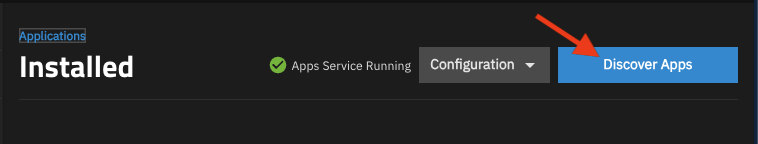
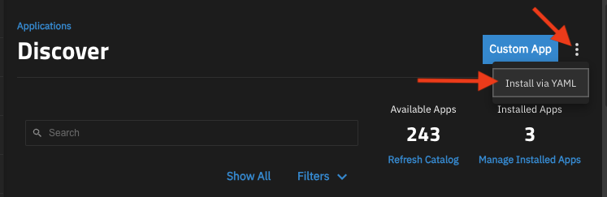
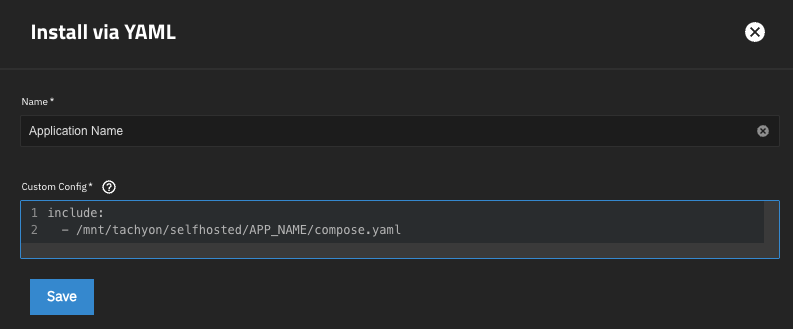

# Self-Hosted Apps on TrueNAS

Thanks to [Christian Lempa](https://github.com/ChristianLempa/boilerplates/tree/main) and [Techo Tim](https://technotim.live/posts/truenas-docker-pro/) for inspiration.

# 🚨 WARNING: 
> This repo is not intended to be generic for wide adoption. These configurations are specific to
> my home lab. Review each file and use at your own risk.

## Docker Network Setup
These docker networks need to be setup first. Get a shell on the server and create these networks.
```shell
docker network create \
  --driver macvlan \
  --subnet=172.23.4.0/24 \
  --gateway=172.23.4.1 \
  --opt parent=eno1 \
  public

docker network create traefik
```

## Setup Custom Apps
1) Under applications, click on Discover Apps

   

1) Open the vertical ellipsis menu and select Install via YAML

   

1) Assign a name and enter the following into the YAML text box. Make sure to update the
   location of your application YAML file in the `include` template.
   ```yaml
   include:
     - /mnt/tachyon/selfhosted/APP_NAME/compose.yaml
   ```

   

## Traefik && Tailscale
Docker compose will automatically read in `.env` files for variable substitution. Once this
repo is cloned onto the server, create a `.env` file with your Cloudflare API key.
```shell
echo "CF_DNS_API_TOKEN=[... TOKEN GOES HERE ...]" > ./traefik/.env
echo "TS_AUTHKEY=[... TOKEN GOES HERE ...]" > ./traefik/.env
```

Also make sure to update the Traefik static [config file here](./traefik/config.yaml).

## MakeMKV
I have two optical drives on my server so I have two instances of MakeMKV set up in my 
docker compose file. Each instance has the proper devices mounted into the container.

On my server the optical drives are assigned to these file handles.
 - `"/dev/sr0"` <=> `"/dev/sg2"`
 - `"/dev/sr1"` <=> `"/dev/sg3"`


If you copy this, make sure to validate the `USER_ID` and `GROUP_ID` environment variables
values match your `truenas_admin` IDs

## Handbrake
My Intel GPU can handle 4 transcodes at once, so we have 4 instances setup. To pass the GPU
to the containers make sure you are passing the correct device. 
```yaml
    devices:
      - "/dev/dri/renderD128:/dev/dri/renderD128"
```

If you copy this, make sure to validate the `USER_ID` and `GROUP_ID` environment variables
values match your `truenas_admin` IDs

## ~~Handbrake-web~~

This project shows some promise, but meh...

Pros
 - Distributed work

 Cons
 - Outdated https://github.com/TheNickOfTime/handbrake-web/issues/337
 - Unable to actually see which tracks or captions are chosen like you can in the real UI.

